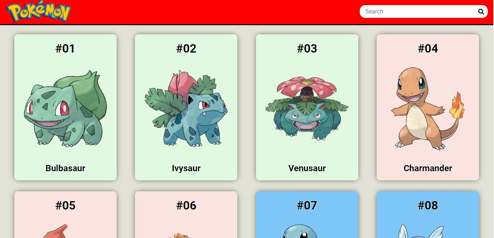
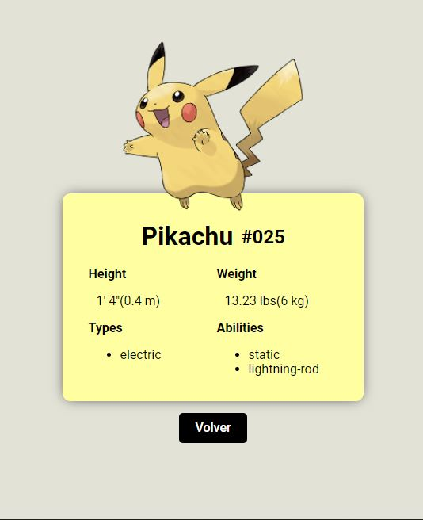

# PokeApp

## Introducción

Se trata de un proyecto donde se utiliza las tecnologias de ReactJS, Redux y Javascript para
el desarrollo de la app, utilizando la Api pokeapi.co.

## Acerca del Proyecto

Este proyecto consiste en la búsqueda de pokemones respecto de su nombre y tambien poder tener mas detalles del mismo.

## Objetivos del proyecto

- Manejar peticiones a APIs.
- Poder encadenar peticiones.
- Uso del Infinite Scroll.
- Manejar respuestas JSON.
- Usar herramientas para consulta de APIs como Postman o Paw.

## Lista de tecnologías

### Interfaz:

HTML, CSS, Javascript, React, Redux.

## Instrucciones de inicio

## BoilerPlate

### _Instale el paquete necesario para ejecutarlo_

- Abra la consola:
  - Dentro de la carpeta raiz, ejecute la línea de comando,` npm install` / `yarn add`.

### _Ejecutar el proyecto_

- Abra la consola :
  - Dentro de la carpeta raiz, ejecute la línea de comando,` npm start` / `yarn start`.

# Pantallas de proyecto

- Home

  

- Detail

  

